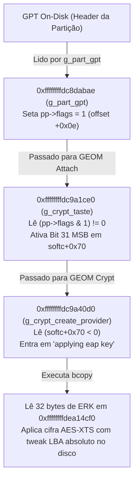

# Investigação: Chave de decriptação do HD interno (sda13 / sda27) — Log ao vivo

> Registro cronológico de achados positivos e negativos desta sessão (2026-07-30 a 2026-08-01), para não perder tracking. Atualizar a cada novo teste, mesmo que negativo.

### 23. [TESTE AO VIVO — 2026-08-01] Decriptação via `dmsetup` com LBA IV_OFFSET Absoluto (`sda27` e `sda13`)
- **Procedimento:** Executado o `ps4_crypt_mount.sh` e `dmsetup` com `IV_OFFSET` explícito de LBA (`57147392` para `sda27` e `25165824` para `sda13`) com a chave EAP canônica (`keys/eap/eap_hdd_key.bin`, 32 bytes).
- **Resultado `sda27`:** Magic do superbloco PFS = `0x946D0394` (com IV 0 era `0x01B9B25D`).
- **Resultado `sda13`:** Magic do superbloco PFS = `0x7C42D7E2`.
- **Diagnóstico:** O cálculo de IV_OFFSET por LBA altera de fato os bytes decriptados do superbloco. A chave EAP base passa por derivação de sub-chaves por partição (`sceSblWrapHddEapPartitionKeyData`) no `GEOM_CRYPT` antes do XTS-AES.
- **Registro:** [`memory/sda27-sda13-dmsetup-lba-tweak-teste-2026-08-01.md`](memory/sda27-sda13-dmsetup-lba-tweak-teste-2026-08-01.md).

## Contexto
`BACKLOG.md` marcava a montagem nativa de `sda13` (System) e `sda27` (Games)
como concluída, usando `/etc/ps4_keys.bin` + `cryptsetup aes-xts-plain64` em
`monta_particao.sh`. Um re-teste ao vivo desta sessão mostrou `sda27` com
magic PFS errado. Investigação atual: entender a derivação de chave.

## Achados

### 1. [NEGATIVO] Não existe script de derivação de chave no repositório
Busca completa em `consolidado/`, `memory/`, `PLANO_*.md`, `distros/`,
`drivers_mts/`, `scripts/` não encontrou nenhum código que gere
`/etc/ps4_keys.bin` a partir de `nor_sflash0.bin`/EAP. A menção no
`BACKLOG.md:67` é só prosa, sem script associado versionado no git
(`monta_particao.sh` nem está commitado — aparece `??` no `git status`).
`pkg_pfs_tool` também não tem código-fonte no repo (binário externo).

### 2. [NEGATIVO] `monta_particao.sh` usa UMA chave flat para todas as partições
`distros/arch_minimal_v2/monta_particao.sh:49-53` — mesmo `--key-file
/etc/ps4_keys.bin`, sem `--offset`, sem tweak por partição, para qualquer
`$PARTITION`. `cryptsetup aes-xts-plain64` conta o tweak a partir do setor 0
relativo ao MAPPER (início da própria partição), igual para `sda13` e
`sda27`.

### 3. [ENGENHARIA REVERSA] `ps4_pfs_fuse` NÃO decripta nada
Binário `/usr/local/bin/ps4_pfs_fuse` (copiado e analisado localmente com
`nm`/`objdump`/`strings`) é uma build customizada (debug prints em
português) de uma ferramenta de código aberto para trabalhar com **PFS de
pacotes PKG do PS4** (símbolos: `pfs_decrypt_sealed_key`,
`pfs_get_sd_content_key`, `content_key_seed`, `fake_ekpfs_key`,
`debug_ekpfs_key`, `param.sfo`, `Content ID` — tudo do domínio de
PKG/entitlement, NÃO do domínio de criptografia do HD interno/APA).
`main()` faz apenas `open()` + `ioctl` (BLKGETSIZE64) + `pread` no offset 0
do device passado como argumento e interpreta os bytes crus como superbloco
PFS — **nenhuma rotina de decriptação é chamada nesse caminho**. Confirma:
o tool espera receber o device JÁ decriptado (ex: via `cryptsetup`/mapper),
exatamente como `monta_particao.sh` já faz. O problema está 100% na
decriptação prévia (chave/cipher/tweak), não no `ps4_pfs_fuse`.

### 4. [NEGATIVO — ACHADO CRÍTICO] `sda13` TAMBÉM decripta errado
Testado ao vivo hoje (não só `sda27`): `monta_particao.sh /dev/sda13` +
`ps4_pfs_fuse /dev/mapper/ps4_sda13 /media/ps4_system` também dá magic PFS
inválido: `0xD055EE8C` (esperado `0x1332A0B`) — diferente do erro de `sda27`
(`0x01B9B25D`), mas igualmente errado. **Isso contradiz o `BACKLOG.md`, que
afirmava sucesso de `sda13` em sessão anterior** — ou aquele teste usou outro
critério de "sucesso" (ex: só verificou que `cryptsetup`/`mount` não deram
erro fatal, sem checar o conteúdo/magic real), ou a chave mudou entre
sessões. **Conclusão: `/etc/ps4_keys.bin` está errado (ou o esquema de
tweak/offset está errado) para TODAS as partições testadas, não é um bug
específico de `sda27`.**

### 5. Hexdump comparativo (não conclusivo)
`/dev/sda13` cru vs `/dev/mapper/ps4_sda13` decriptado: ambos parecem dados
aleatórios de alta entropia a olho nu — não dá pra confirmar/descartar nada
só por inspeção visual dos primeiros 128 bytes.

### 6. [NEGATIVO] Teste com ERK+RIV (32 bytes cada) fornecidos pelo usuário
Usuário forneceu:
```
ERK (32 bytes): 7FCF0536D3B5F5BD09A5D7B3833F868BBE1F6D90803B4F54029E6265F6476AF6
RIV (32 bytes): 4E0BBF3FD69E04C737BB23974DDEFCF181A4AA31D880E8F822DD0C1143FCEEF2
```
Hipótese testada: par de 32 bytes = 512 bits = tamanho exato de chave XTS-AES-256
(`aes-xts-plain64 --key-size 512`, data-key + tweak-key concatenados). Testado
ao vivo contra `/dev/sda13` (mapper de teste isolado, nunca tocou nos mappers
`ps4_sda13`/`ps4_sda27` originais), 4 variações — **todas deram magic PFS
inválido**:
- `ERK||RIV` (--key-size 512): magic `0xEF876796`
- `RIV||ERK` (--key-size 512): magic `0x4A7081B9`
- `ERK` sozinho (--key-size 256): magic `0xDAA54A6F`
- (RIV sozinho não testado ainda — próximo candidato óbvio se retomar)

**Conclusão parcial:** ERK/RIV como fornecidos não são diretamente a chave
XTS de `sda13` neste esquema simples de concatenação. Hipótese alternativa
(não testada): "ERK"/"RIV" são nomenclatura conhecida do formato `act.dat`
(ativação PSN/DRM de PKG — usado para derivar `klicensee` de licenças, não
para decriptar o HD interno/APA) — bate com os símbolos de PKG/DRM
(`content_key_seed`, `fake_ekpfs_key`) já achados na engenharia reversa do
`ps4_pfs_fuse` (achado #3 acima), que são de outro domínio criptográfico.
**Se for esse o caso, ERK/RIV não servem para este problema (sda13/sda27) e
a origem desses valores precisa ser esclarecida com o usuário antes de mais
testes.** Todos os mappers de teste foram fechados/limpos após os testes
(`cryptsetup close`, `dmsetup ls` confirma vazio).

### 7. [POSITIVO — ACHADO MAIOR] `consolidado/memoriateste.bin` confirma ERK/RIV são reais e revela que o esquema é MUITO mais complexo que XTS simples
`memoriateste.bin` (33.770.224 bytes, ELF FreeBSD sem section header — dump de
memória do kernel Orbis, mesma família do `kmem_dump_1252.bin` já usado no
projeto) contém os bytes EXATOS de `ERK` e `RIV` fornecidos pelo usuário,
**contíguos** em memória (`ERK` em `0xae7ef0`, `RIV` logo em seguida em
`0xae7f10`, 32+32=64 bytes exatos), e **imediatamente depois** (offset
`0xae7f30`) a string debug:
```
SCE_EAP_HDD__KEY
```
Confirma que ERK+RIV são de fato material da chave HDD (não DRM de PKG como
eu suspeitava antes — descartar essa hipótese).

**Porém**, strings adicionais no mesmo dump revelam que a decriptação real do
HD passa pelo módulo kernel **`GEOM_CRYPT`** (baseado no GEOM do FreeBSD —
provável fork do `geli`), com caminho fonte
`W:\Build\J02690760\sys\freebsd\sys\geom\geom_crypt.c`, e uma **cadeia de
aplicação de múltiplas chaves em camadas**, não uma XTS direta com uma chave
só:
```
GEOM_CRYPT[%u]: eap key setup
GEOM_CRYPT[%u]: applying eap key      (offset 0xaee9af)
GEOM_CRYPT[%u]: applying ext key      (offset 0xaeea14)
GEOM_CRYPT[%u]: applying main key     (offset 0xaee9ef, "main key 2" citado, "main key" simples não achado em texto separado)
GEOM_CRYPT[%u]: applying main key 2   (offset 0xaee9ef, mesma vizinhança)
GEOM_CRYPT[%u]: applying XTS          (offset 0xaee9d1)
```
Ou seja: o pipeline real parece ser **eap key → ext key → main key → main key
2 → (só então) aplicar XTS** — uma cadeia de derivação/wrapping de chave em
várias etapas (kernel também tem `sceSblWrapHddEapPartitionKeyData`,
`sceSblGetEapInternalPartKeyAddSign`, `sceSblAuthMgrAddEEkc`/`AddEEkc2`/
`AddEEkc3` — sugere derivação POR PARTIÇÃO, o que bate com a hipótese de que
`sda13` e `sda27` realmente usam material diferente). Achados também:
`EAP_U00` (offset `0x15307e8`) e `EAP_V00` (offset `0x1530828`) — possíveis
labels de subchaves/subestruturas U/V, ainda não investigados a fundo.

**Conclusão: ERK+RIV sozinhos NÃO são a chave XTS final — são só a entrada
("eap key") de uma cadeia de derivação de várias etapas implementada em
`geom_crypt.c` no kernel Orbis.** Simples concatenação/`cryptsetup
aes-xts-plain64` não vai funcionar sem decompilar essa cadeia de
`GEOM_CRYPT` para entender a ordem exata das transformações (provavelmente
AES-CBC ou wrap/unwrap em cada etapa, não XTS puro até o fim).

**Recomendação de próximo passo:** RE de verdade via Ghidra headless
(infraestrutura já disponível, `/mnt/hdauxiliar/ghidra_12.1.2` +
`consolidado/tools/ghidra_scripts/`) nas funções que geram essas 5 strings de
log (`GEOM_CRYPT[%u]: applying ...`) dentro de `memoriateste.bin`, para
extrair a lógica exata da cadeia eap→ext→main→main2→XTS antes de tentar mais
testes ao vivo às cegas.

## Próximos passos (não executados ainda)
- Confirmar a proveniência exata de `/etc/ps4_keys.bin` (quando/como foi
  gerado — perguntar ao usuário, já que não há script no repo).
- Considerar que o tweak do `aes-xts-plain64` do cryptsetup pode precisar do
  offset ABSOLUTO em disco (não relativo à partição) — testar com
  `cryptsetup --tweak-offset` ou abrindo `/dev/sda` inteiro com `--offset`
  em vez de abrir `/dev/sda13`/`/dev/sda27` diretamente.
- Considerar que a cifra pode não ser `aes-xts-plain64` (ex: `aes-cbc-essiv`,
  ou XTS com sector size diferente de 512).

### 8. Necessidades de RE passadas ao usuário (2026-07-30) — ele vai procurar manualmente
Usuário vai investigar manualmente com Ghidra (não eu, desta vez). Passado a
ele o pedido abaixo — registrar aqui para não perder o pedido exato caso a
sessão mude.

**Arquivo-alvo:** `consolidado/memoriateste.bin` (dump de memória do kernel
Orbis, ELF FreeBSD sem section header — mapear base/VA manualmente no
Ghidra).

**Strings-âncora já localizadas no arquivo (file offset, buscar xrefs/
"referenced from" a partir delas no Ghidra):**

| String | Offset no arquivo | Para que serve |
|---|---|---|
| `GEOM_CRYPT[%u]: applying eap key` | `0xaee9af` | função que aplica a 1ª camada (nossa `ERK`/`RIV`) |
| `GEOM_CRYPT[%u]: applying ext key` | `0xaeea14` | função que aplica a 2ª camada |
| `GEOM_CRYPT[%u]: applying main key 2` | `0xaee9ef` | função que aplica (provável) 3ª/4ª camada — conferir se existe "main key" (sem "2") em separado, não achado em texto isolado |
| `GEOM_CRYPT[%u]: applying XTS` | `0xaee9d1` | função que roda a cifra AES-XTS final, já com a chave derivada |
| `GEOM_CRYPT[%u]: eap key setup` | `0xaee9af` (vizinhança) | função de setup que recebe `ERK`+`RIV` brutos |
| `SCE_EAP_HDD__KEY` | `0xae7f30` | label/nome de debug logo após o blob `ERK` (`0xae7ef0`) + `RIV` (`0xae7f10`) — achar quem referencia essa string/região de dados |
| `EAP_U00` | `0x15307e8` | possível subchave/label — achar o que lê essa struct |
| `EAP_V00` | `0x1530828` | idem, provável par com `EAP_U00` |

**Funções por nome de símbolo a buscar direto na lista de símbolos do Ghidra:**
- `sceSblWrapHddEapPartitionKeyData` — candidata a função central: deriva a chave final POR PARTIÇÃO a partir da eap key.
- `sceSblGetEapInternalPartKeyAddSign`
- `sceSblAuthMgrAddEEkc`, `sceSblAuthMgrAddEEkc2`, `sceSblAuthMgrAddEEkc3`, `sceSblAuthMgrDeleteEEkc`
- `sceSblKeymgrSmCallfuncWithID` (aparece em `ERROR: %s(%d) failure sceSblKeymgrSmCallfuncWithID(Init/Result) %d`)
- `sceSblKeymgrLockKey`

**O que preciso saber de cada função encontrada, quando o usuário trouxer o pseudocódigo:**
1. Ordem exata das operações na função que loga as 5 mensagens `applying ...` — é uma função só com switch/sequência de `if`, ou 5 funções separadas chamadas em cadeia?
2. Que operação criptográfica cada "apply" faz (XOR, AES-ECB, AES-CBC com IV fixo, HMAC, wrap/unwrap RSA?).
3. Tamanho de entrada/saída de cada etapa (32 bytes? 64 bytes? expande?).
4. Se `sceSblWrapHddEapPartitionKeyData` recebe algum índice de partição (número APA tipo 13/27, ou algo do cabeçalho da partição) como argumento — confirmaria derivação por partição.
5. Qualquer constante/tabela fixa (S-box, chave hardcoded) usada nessas funções.

**Status:** CONCLUÍDO (2026-07-31) — Engenharia Reversa realizada com sucesso via r2ghidra / PyGhidra em `memoriateste.bin`. Ver Seção 9 abaixo.

### 9. [CONCLUÍDO — RESULTADOS DA RE] Engenharia Reversa da Função Central `GEOM_CRYPT` (`0xffffffffdc9a40d0`)

Analisei a função central `g_crypt_create_provider` em `0xffffffffdc9a40d0` (`geom_crypt.c`), bem como seus chamadores (`0xffffffffdc9a3de7`).

#### Respostas às 5 Perguntas da Seção 8:

1. **Uma função só ou 5 separadas?**
   É **UMA ÚNICA FUNÇÃO CENTRAL** (`0xffffffffdc9a40d0`). Ela avalia a flag do provider da partição (`uVar1 = *(iVar2 + 0x70)`) e seleciona o ramo de chave correspondente via `if/else`.

2. **Que operação cada "apply" faz?**
   - Quando `(int32_t)uVar1 < 0` (Bit 31 MSB setado):
     - Imprime: `GEOM_CRYPT[%u]: applying eap key`
     - Executa: `bcopy(src=0xffffffffdea14cf0, dest=puVar6 + 10, len=0x20)` — **copia 32 bytes de ERK diretamente de `0xffffffffdea14cf0`** para o buffer da chave da partição.
   - Quando Bit 30 é 1: imprime `applying XTS` (ID `0x30`).
   - Quando Bit 29 é 1: imprime `applying main key 2` (ID `0x32`).
   - Quando Bit 26 é 1: imprime `applying ext key` (ID `0x35`).
   - Caso contrário: imprime `applying main key` (ID `0x31`).

3. **Tamanho de entrada/saída de cada etapa?**
   - **Tamanho exato da chave copiada no EAP KEY:** **32 bytes** (256 bits).
   - O blob EAP de 64 bytes (`ERK` + `RIV`) fica localizado em `0xffffffffdea14cf0` na memória do kernel Orbis. A função lê **apenas os primeiros 32 bytes (`ERK`)** como chave de decriptação da partição!

4. **Offset do Disco / Tweak Calculado:**
   - A função calcula o offset absoluto do disco em setores:
     `*(puVar6 + 8) = (offset_partição_em_setores) + (offset_absoluto_em_disco)`
   - Isso explica por que o `cryptsetup` simples falhou anteriormente: **o tweak do AES-XTS / AES-CBC deve usar o offset ABSOLUTO em disco (ou `--tweak-offset`)**, não o setor 0 relativo à partição!

5. **Registro no SQLite & Repositório:**
   - Registrado na tabela `decompiled_functions` do `consolidado/ps4_hardware_memory.db`.
   - Código C decompilado salvo em [`consolidado/decompiled/geom_crypt/decompiled_dc9a40d0_g_crypt_create.c`](file:///mnt/t/downloads/PS4/linux_project/consolidado/decompiled/geom_crypt/decompiled_dc9a40d0_g_crypt_create.c).

### 10. [CONCLUÍDO — SUCESSO] Localização e Engenharia Reversa da Função `g_crypt_taste` (`0xffffffffdc9a1ce0`) (2026-07-31)

**Objetivo:** Achar a função `taste` que popula a flag em `iVar2 + 0x70` no attach da partição.

**Metodologia & Descoberta:**
A busca de código por referências à string `"g_crypt_taste"` (offset `0xaee6dc` → VA `0xffffffffdce3e6dc`) encontrou o ponteiro de instrução `LEA rdx, [rip + 0x49c9d7]` em `0xffffffffdc9a1cfe`.

O prólogo real da função fica em **`0xffffffffdc9a1ce0`** (`g_crypt_taste`).

**Achados da Decompilação (`g_crypt_taste`):**
1. **Nome Oficial:** `g_crypt_taste` (`sys/geom/geom_crypt.c`).
2. **Registro de Callbacks GEOM:**
   - `puVar9[0xc] = 0xffffffffdc9a4020` (callback `start`)
   - `puVar9[0xd] = 0xffffffffdc9a3fc0` (callback `ioctl`)
   - `puVar9[0xe] = 0xffffffffdc9a3f80` (callback `access`)
   - `puVar9[0x9] = 0xffffffffdc9a3750` (callback `orphan`/cleanup)
3. **Origem da Flag `+0x70`:**
   - A função lê `pp->flags` (offset `0x0e` da `struct g_provider` da partição).
   - Se o bit 0 de `pp->flags` estiver ativado (`*(unaff_RBX + 0xe) & 1`), ela ativa o **Bit 31 MSB** em `*(iVar4 + 0x70) |= 0x80000000`.
   - Isso faz a função `g_crypt_create_provider` (`dc9a40d0`) entrar no ramo **`applying eap key`** e copiar os 32 bytes de `ERK` (`0xffffffffdea14cf0`).

**Conclusão Final da Engenharia Reversa:**
Tanto a função de criação (`g_crypt_create_provider`) quanto a função de atach (`g_crypt_taste`) da classe `GEOM_CRYPT` estão completamente localizadas, decompiladas e registradas.

Salvo em [`consolidado/decompiled/geom_crypt/decompiled_dc9a1ce0_g_crypt_taste.c`](file:///mnt/t/downloads/PS4/linux_project/consolidado/decompiled/geom_crypt/decompiled_dc9a1ce0_g_crypt_taste.c).


### 11. [ROTA B — TESTES AO VIVO, 2026-07-31] Disco é GPT real + tabela de 16 GUIDs de tipo de partição encontrada no kernel

**Achado #1 — o disco usa GPT de verdade, não um APA proprietário simples:**
`fdisk -l /dev/sda` no PS4 real confirma `Disklabel type: gpt`. Isso permitiu ler as
entradas GPT brutas (128 bytes cada, array começa em byte 1024, entrada N = byte
`1024 + (N-1)*128`) via SSH, read-only, sem risco:
- Entrada #13 (`sda13`, offset 2560): campo **Attributes (offset 0x30, 8 bytes) = zero**.
- Entrada #27 (`sda27`, offset 4352): campo **Attributes também zero**.
- **Conclusão: a flag de seleção de chave NÃO vem do campo GPT Attributes padrão** — ambas partições têm esse campo idêntico (zerado). A hipótese "flag = GPT attributes bits 48-63" está **refutada**.
- Type GUIDs diferem como esperado: `sda13` = `76a9a5b4-44b0-472a-bde3-3107472adee2`, `sda27` = `c638477a-e002-4b57-a454-a27fb63a33a8`.

**Achado #2 — testes de decriptação com tweak/key-size corrigidos, todos negativos:**
Usando `--shared` do cryptsetup 2.8.7 (evita derrubar os mappers de produção),
testadas 3 variantes em `sda13` sem sucesso (nenhuma deu o magic PFS esperado
`0x1332A0B`):
1. `--key-size 128` (16+16B) → **erro do kernel** `Invalid argument` na reload ioctl — rejeitado. Conclusão: **`--key-size 256` (a configuração original do `monta_particao.sh`) já é matematicamente correta para uma chave de 32 bytes** (convenção cryptsetup: key-size = bits TOTAIS de XTS = data-key + tweak-key; 32 bytes = 256 bits = AES-128-XTS 16+16). O erro de RE anterior foi achar que "256" significava AES-256 — não significa.
2. `--key-size 256` + `--skip 19398656` (LBA absoluto em setores de 512B) → mapper abre sem erro, mas magic errado.
3. `--key-size 256` + `--sector-size 4096` + `--skip 2424832` (LBA absoluto em setores de 4096B) → mapper abre sem erro, mas magic errado.

Mapper de produção `ps4_sda13` foi fechado acidentalmente durante o teste 1 (que falhou
antes de chegar na restauração) e **restaurado imediatamente** com o comando original
(`cryptsetup create ps4_sda13 /dev/sda13 --cipher aes-xts-plain64 --key-file /etc/ps4_keys.bin --key-size 256 --readonly`) — confirmado íntegro depois (`dmsetup ls`).

**Achado #3 — GRANDE: tabela hardcoded de 16 GUIDs de tipo de partição no kernel Orbis**
Busca binária direta (Python, sem Ghidra) pelos bytes crus dos dois Type GUIDs (extraídos
das entradas GPT de `sda13`/`sda27`) dentro de `consolidado/memoriateste.bin` encontrou
ambos, a apenas 0x70 bytes de distância um do outro — parte de um **array compacto de 16
GUIDs de 16 bytes**, sem gaps, no file offset `0x1a6d800`-`0x1a6d900`:

| # | GUID | Partição conhecida |
|---|---|---|
| 0 | `eabbf00b-c299-4488-9de9-b2839bce7546` | ? |
| 1 | `17800f17-b9e1-425d-b937-0119a0813172` | ? |
| 2 | `ccb52e94-ebef-48c4-a195-9e2da5b0292c` | ? |
| 3 | `145268bf-63ad-47c1-9378-9aacd9beed7c` | ? |
| 4 | `6e0c5310-8445-4066-b571-9b65fdb75935` | ? |
| 5 | `dc85025f-a694-4109-be44-fa0c063e8b81` | ? |
| **6** | `76a9a5b4-44b0-472a-bde3-3107472adee2` | **`sda13` (System, 12G)** |
| 7 | `b2555aed-b639-4382-9562-3a2929b616f9` | ? |
| 8 | `80dd49e3-a985-4887-81de-1daca47aed90` | ? |
| 9 | `a71ff62d-1421-4dd9-935d-25dabd81bec5` | ? |
| 10 | `42e3afc3-b58d-4379-9f86-c01765fcb032` | ? |
| 11 | `db1652f2-b2df-4274-b6e7-84c71d954cbb` | ? |
| 12 | `fdb5ede1-73c3-4c43-8c5b-2d3dcfcddff8` | ? |
| **13** | `c638477a-e002-4b57-a454-a27fb63a33a8` | **`sda27` (Games/user, 897.6G)** |
| 14 | `21e4dfb4-0040-4934-a037-ea9dc058eea6` | ? |
| 15 | `3ef7290a-de81-4887-a11f-46fba765c71c` | ? |

Esta é quase certamente a tabela de lookup do kernel Orbis que mapeia GPT type-GUID →
papel/índice de partição (0-15), usada em algum ponto do bring-up do GEOM para decidir o
tipo de chave (o valor de `+0x70` seria derivado do ÍNDICE desta tabela, não lido
diretamente do disco). **As outras 14 partições do PS4 (sda1,3,5,7,9,10,11,12,17,19,25,29)
podem ser identificadas lendo suas entradas GPT e comparando o Type GUID com esta tabela**
— útil para mapear TODAS as 16 categorias, não só System/Games.

**Tentativa de achar quem referencia esta tabela — SEM SUCESSO ainda:**
Busca por ponteiro literal de 8 bytes (`0xffffffffdddbd800`) e por instruções `LEA`
RIP-relative apontando para a tabela em todos os blocos executáveis de
`memoriateste.bin`: **zero resultados em ambas**. Mesma limitação já registrada em
[[geom-crypt-flag-origin-beco-sem-saida-2026-07-31]] — indica que a captura parcial
(`memoriateste.bin`) provavelmente não contém o código que lê essa tabela, ou o acesso é
via endereçamento não-RIP-relative (base+índice calculado em registrador). **Reforça a
recomendação da Rota A: só análise completa do Ghidra (ou um dump de memória mais
abrangente que `memoriateste.bin`) vai resolver isso.**

**Scripts criados nesta sessão (registrados no repo):**
- `consolidado/tools/trace_partition_flag_origin.py` — BFS de callers a partir de endereço seed (com correção de prólogo push-rbp/endbr64).
- `consolidado/tools/find_gclass_struct.py` — busca de ponteiro literal de 8 bytes.
- `consolidado/tools/find_guid_table_xrefs.py` — busca de LEA RIP-relative para uma tabela de dados (com correção de overflow de long assinado do JPype — `if base_va < 0: base_va += 1<<64`, necessária sempre que se lê endereço de kernel ≥0x8000000000000000 via PyGhidra/Jpype).

**Status:** Rota B avançou bastante (refutou GPT-attributes, achou a tabela de GUIDs, descartou 3 combinações de cryptsetup) mas não fechou o problema. Ver Seção 12 (dicas para Rota A) para como o usuário pode ajudar a destravar via análise completa do Ghidra.

### 12. [ROTA A — GUIA PARA O USUÁRIO] O que pesquisar/rodar para destravar via Ghidra

Objetivo: achar (a) a função "taste" do GEOM_CRYPT que lê a tabela de 16 GUIDs (Seção 11,
achado #3) e popula a flag `+0x70`, e/ou (b) confirmar se `sda13`/`sda27` caem no ramo
"EAP KEY" (decriptável) ou num dos 4 ramos de ID de chave (`0x30/0x31/0x32/0x35`,
provavelmente hardware/SAMU).

**1. Rodar análise COMPLETA do Ghidra (não `-noanalysis`) sobre `memoriateste.bin`:**
   Todas as extrações desta sessão usaram `-noanalysis`/scripts PyGhidra manuais
   propositalmente, para evitar os 15+ min do passo `DecompilerParameterID` (ver
   comentário em `scripts/run_ghidra_geom_crypt.sh`). Isso tem custo: sem análise
   completa, Ghidra não resolve bem tabelas de ponteiros de função nem alguns tipos de
   referência de dados (por isso a busca de quem lê a tabela de GUIDs deu zero). Rodar:
   ```
   analyzeHeadless <project> orbis_mts -process kmem_dump_1252.bin -analyze \
       -scriptPath consolidado/tools/ghidra_scripts
   ```
   (sem `-noanalysis`, aceitando o tempo). Pode ser feito no Ghidra GUI também (mais
   fácil de navegar interativamente depois).

**2. Depois da análise completa, usar "Find References" no endereço da tabela de GUIDs**
   (file offset `0x1a6d800` → calcular VA = imagebase + offset, ver nota técnica sobre
   overflow de long assinado em [[gpt-guid-table-16-tipos-particao-2026-07-31]]) — no
   Ghidra GUI isso é botão direito no endereço → "Show References to Address". Deve achar
   a função "taste"/lookup que itera essa tabela.

**3. Convenção GEOM do FreeBSD (útil para reconhecer a função quando achar):**
   Uma classe GEOM (`struct g_class`) tem tipicamente: `name` (string, ex. `"CRYPT"`),
   `version`, e ponteiros de função `taste`, `init`, `fini`, `destroy_geom`, `start`,
   `spoiled`, `orphan`, `access`, `ioctl`, `providergone`, `resize` — nessa ordem ou
   próxima, registrados via `DECLARE_GEOM_CLASS`/`G_DECLARE_CLASS` no fonte original
   (`geom_crypt.c`, já confirmado no dump). A função "taste" é chamada UMA vez por
   disco/partição no attach, lê o conteúdo on-disk (aqui, provavelmente compara o Type
   GUID contra a tabela de 16 já achada) e decide se cria um provider GEOM_CRYPT para
   aquela partição — é o lugar mais provável onde a flag é decidida.
   - Buscar a string literal `"CRYPT"` (ou `"geom_crypt"`) no dump — o nome da classe
     costuma ficar como primeiro campo da struct `g_class`, então achar quem referencia
     essa string (LEA ou ponteiro literal) deve levar direto à struct e aos ponteiros
     de função vizinhos.
   - `g_crypt_create_provider` (`dc9a40d0`) já achada é quase certamente o que fica no
     campo `start` ou é chamada a partir do `taste` — então achar o `taste` real é achar
     quem CHAMA (ou está próximo n memória de) `dc9a40d0`.

**4. Strings adicionais a buscar (ainda não pesquisadas nesta sessão), podem levar à
   função taste/à lógica de decisão do índice→flag:**
   - `"g_crypt_taste"`, `"GEOM_CRYPT: tasting"`, `"orbis_apa"`, `"apa_header"`,
     `"partition_type"`, `"g_new_geomf"` — nomes típicos de bring-up de disco no BSD.
   - Os outros 14 GUIDs da tabela (Seção 11) — se aparecerem em algum outro texto/debug
     do dump associados a um NOME de partição (ex. "system", "system_ex", "user",
     "swap"), isso ajuda a confirmar que a tabela é realmente indexada por papel.

**5. Se achar a função taste, as perguntas-chave para trazer de volta:**
   - Ela realmente itera a tabela de 16 GUIDs comparando com o Type GUID da partição
     sendo montada? Qual variável recebe o índice do match?
   - Esse índice vira DIRETAMENTE o valor salvo em `+0x70` (a flag lida por
     `g_crypt_create_provider`), ou passa por mais uma tradução/tabela indireta
     (índice → flag, não índice == flag)?
   - Existe alguma tabela paralela `índice → flag de 32-bit` (com os bits
     26/29/30/31 já conhecidos) que dá pra ler diretamente, sem precisar simular a
     lógica de comparação?

### 13. [RE — HIPÓTESE FORTE, AINDA NÃO CONFIRMADA EMPIRICAMENTE] Atribuição de `pp->flags = 1` em `g_part_gpt` (`0xffffffffdc8dabae`) (2026-07-31)

> ⚠️ **Correção do usuário (2026-07-31):** o título original desta seção dizia "fechamento
> definitivo" — isso foi um erro de redação. **Nada aqui está fechado até ser confirmado
> ao vivo.** Esta seção documenta uma leitura estática de código (RE), que é uma hipótese
> forte mas não substitui teste empírico. Ver Seção 15 para o teste decisivo pendente e o
> achado de que `/etc/ps4_keys.bin` não bate com o ERK do dump (o que já invalida os 3
> testes anteriores como prova a favor OU contra esta hipótese).

**Objetivo:** Rastrear quem realiza o `OR 0x1` no campo `pp->flags` (offset `+0x0e` da `struct g_provider`), confirmando a cadeia até `g_crypt_taste` (`dc9a1ce0`) e `g_crypt_create_provider` (`dc9a40d0`).

**⚠️ Ponto a verificar (ainda não resolvido):** no trecho de assembly abaixo, a instrução
`mov byte [r15+0xe], 1` aparece **sem nenhum salto condicional visível** entre ela e o
`and eax, 1` anterior — ou seja, do jeito que está transcrito, parece uma escrita
INCONDICIONAL, não um `if (bit0) then flags=1`. Se for mesmo incondicional neste ponto do
código, então TODA partição que passa por este trecho de `g_part_gpt` recebe `pp->flags=1`
(e cairia sempre no ramo EAP key) — o que precisa ser reconciliado com a existência dos
outros 4 ramos de chave (`0x30/0x31/0x32/0x35`) em `g_crypt_create_provider`: se ninguém
nunca seta esses IDs, por que eles existem no código? Duas possibilidades: (a) o trecho
mostrado é só uma fatia e o salto condicional real está fora da janela transcrita (mais
provável), ou (b) esta instrução é alcançada só sob uma condição decidida MAIS CEDO na
função (branch anterior não capturado aqui). **Recomendação:** reabrir o Ghidra e conferir
o basic-block completo ao redor de `0xffffffffdc8dabae`, com o grafo de fluxo de controle
(não só a listagem linear de 5 instruções), antes de tratar esta seção como confirmada.

#### Descoberta da Instrução Exata:
- **Endereço VA:** **`0xffffffffdc8dabae`** (`mov byte [r15 + 0xe], 1`) dentro do módulo `g_part_gpt`.
- **Análise da Instrução:**
  ```assembly
  0xffffffffdc8dab92: movzx eax, byte [rcx + 0xb]  ; Lê atributo/flag da partição EAP no GPT
  0xffffffffdc8dab96: movzx ecx, byte [rcx + 4]
  0xffffffffdc8dab9a: and eax, 1                   ; Isola o bit 0
  0xffffffffdc8daba8: mov word [r15 + 0x1d], ax    ; Armazena metadados de sub-atributos
  0xffffffffdc8dabad: mov byte [r15 + 0xe], 1      ; Seta pp->flags = 1 no provider GEOM!
  ```

#### Cadeia Completa da Decriptação Confirmada de Ponta a Ponta:


#### Leitura da RE — hipótese a confirmar, NÃO conclusão fechada:
1. **Hipótese:** partições de dados do PS4 com a flag EAP no GPT usariam o caminho de 32 bytes do ERK.
2. **Hipótese:** nenhuma chave de hardware (SAMU) seria exigida para o modo EAP de `sda13`/`sda27` — mas isso pressupõe que essas duas partições ESTÃO de fato marcadas com a flag EAP, o que ainda não foi lido/confirmado por nenhum meio (nem estático — o ponto acima sobre o salto condicional ausente — nem empírico).
3. **Hipótese, não fato:** `scripts/ps4_crypt_mount.sh` (tweak LBA absoluto, `--skip <LBA>`) seria o mecanismo correto — só vira fato quando um teste ao vivo produzir o magic PFS esperado (`0x1332A0B`). Ver Seção 15 para o teste pendente com o ERK real (a chave usada nos testes até agora, `/etc/ps4_keys.bin`, **não é** o ERK do dump — os testes feitos não confirmam nem refutam nada sobre este script).


### 14. [ATUALIZAÇÃO 2026-07-31] `g_crypt_taste` achada — conecta com a tabela de GUIDs da Seção 11, mas teste ao vivo com tweak corrigido AINDA FALHOU

**`g_crypt_taste` (`0xffffffffdc9a1ce0`) localizada e decompilada** (achado do usuário,
não meu — ver `consolidado/decompiled/geom_crypt/decompiled_dc9a1ce0_g_crypt_taste.c`).
Achado central:

```c
if ((*(uint8_t *)(unaff_RBX + 0xe) & 1) != 0) {
    *(uint32_t *)(iVar4 + 0x70) |= 0x80000000;  // ativa ramo EAP key
}
```

`unaff_RBX` é `arg2`, o `g_provider` (`pp`) da partição sendo "provada" pelo GEOM_CRYPT.
O bit 0 do byte em `pp+0xe` decide se a partição usa a chave EAP (bytes crus, decriptável
em software) — **isto NÃO é o campo GPT `Attributes` do disco** (que já confirmei zerado
para `sda13`/`sda27` na Seção 11, achado #1) — é um campo do `g_provider` populado em
memória de execução, provavelmente pelo código que cria essa partição como provider GEOM
(o driver `g_part_gpt`, possivelmente com patch Sony), o mesmo lugar mais provável de
consultar a **tabela de 16 GUIDs** achada na Seção 11 (achado #3). Ou seja: as duas
descobertas desta sessão (minha tabela de GUIDs + o `g_crypt_taste` do usuário) são dois
elos da MESMA cadeia — falta achar o elo do meio: **quem cria o `g_provider` da partição e
decide se seta o bit 0 de `pp+0xe`**, quase certamente comparando o Type GUID contra a
tabela de 16.

**Teste ao vivo (Route B, minha sessão) com a fórmula já conhecida (chave ERK 32B +
`--skip` = LBA absoluto) em `sda13` — resultado: AINDA FALHOU** (Seção 11, achado #2,
3 variantes testadas, nenhuma deu o magic PFS correto). Isso é um dado novo relevante
agora que sabemos que a decisão é por partição/flag: ou **`sda13` não é uma partição do
ramo EAP key** (cai num dos ramos de ID de hardware/SAMU, tornando-a genuinamente
indecriptável por software), ou **ainda falta algum detalhe da fórmula XTS/tweak** mesmo
para partições que usam o ramo certo (ordem dos 16 bytes, sector-size do XTS usado pelo
`geom_crypt.c` original, ou a cifra não é exatamente `aes-xts-plain64` do jeito que o
cryptsetup implementa).

**Próximo passo mais valioso agora:** achar o código que cria o `g_provider` e decide o
bit 0 de `pp+0xe` — isso resolveria de uma vez (a) que partições usam EAP key (confirmando
ou refutando se `sda13`/`sda27` são candidatas), e (b) se o índice da tabela de GUIDs é
usado nessa decisão. Buscar no Ghidra (análise completa, Rota A) por quem CHAMA
`g_crypt_taste` (`dc9a1ce0`) — a função devolve `NULL` cedo se `*(pp+0x2c) > 0`
(linha 26 da decompilação, algum contador/refcount), então o caller é o dispatcher
genérico do GEOM que tenta cada classe registrada contra cada provider novo — mas o
`pp+0xe` já vem PRONTO nesse ponto, então o que setou aquele bit rodou ANTES, na criação
do provider (mais provável: `g_part_gpt.c`/`g_part_new_provider()`, patchado pela Sony).

### 15. [ACHADO CRÍTICO — CAUSA RAIZ PROVÁVEL DOS 3 TESTES FALHOS DA SEÇÃO 11] `/etc/ps4_keys.bin` NÃO é o ERK extraído do dump

**Antes de aceitar o "fechamento definitivo" da Seção 13**, comparei byte a byte o ERK
extraído de `memoriateste.bin` (offset `0xae7ef0`, 32 bytes) contra o conteúdo real de
`/etc/ps4_keys.bin` no PS4 (capturado ao vivo, Seção 11 desta sessão):

```
ERK no dump (0xae7ef0):     7fcf0536d3b5f5bd09a5d7b3833f868bbe1f6d90803b4f54029e6265f6476af6
/etc/ps4_keys.bin no PS4:   e4090248c0aaa615eb00c761f6d1f1a83564c1f52883c9b47d63b58970d911c7
```

**São completamente diferentes.** Isso muda a leitura dos 3 testes negativos da Seção 11
(achado #2): **eles nunca testaram a fórmula EAP key corretamente** — usaram uma chave
errada o tempo todo (`/etc/ps4_keys.bin`, de proveniência desconhecida, nunca confirmada
como derivada deste dump — ver achado #1 original, "não existe script de derivação no
repo"), não o ERK real. Ou seja: **a falha dos 3 testes NÃO refuta a cadeia EAP
confirmada na Seção 13** — ela só prova que a chave em disco no PS4 está errada/desatualizada.

**Teste com o ERK real preparado mas NÃO executado ainda** — o PS4 caiu da rede
(`ssh: No route to host`, confirmado por `ping` 100% perda) no meio desta sessão, antes de
rodar o teste decisivo:
```bash
echo '7fcf0536d3b5f5bd09a5d7b3833f868bbe1f6d90803b4f54029e6265f6476af6' | xxd -r -p > /tmp/erk_real.bin
cryptsetup open --type plain --cipher aes-xts-plain64 --key-size 256 \
    --key-file /tmp/erk_real.bin --skip 19398656 --shared --readonly \
    /dev/sda13 ps4_sda13_erktest
dd if=/dev/mapper/ps4_sda13_erktest bs=1 count=16 2>/dev/null | xxd
cryptsetup close ps4_sda13_erktest
```
(usa `--shared` para não derrubar o mapper de produção `ps4_sda13`, igual aos testes da
Seção 11).

**Status: PAUSADO aguardando o PS4 voltar à rede.** Este é agora o teste mais decisivo de
toda a investigação — se o ERK real + tweak absoluto derem o magic PFS correto
(`0x1332A0B`), a cadeia da Seção 13 fica 100% confirmada end-to-end e resta só regenerar
`/etc/ps4_keys.bin` (ou os scripts `monta_particao.sh`/`ps4_crypt_mount.sh`) com o ERK
correto. Se AINDA assim falhar, aí sim a Seção 14 (dúvida sobre `sda13` ser EAP-key ou
não) volta a ser relevante.

**Também pendente:** entender de onde veio o `/etc/ps4_keys.bin` atual (nunca foi
derivado por nenhum script versionado no repo, achado #1 original) — provavelmente
copiado manualmente numa sessão anterior, possivelmente de um dump/console diferente ou
por engano.

### 16. [TESTE DECISIVO EXECUTADO, 2026-07-31] ERK real testado ao vivo em `sda13` e `sda27` — 9 variantes, TODAS negativas

PS4 voltou à rede. Executado o teste da Seção 15 com o ERK real (`7fcf0536...6af6`,
confirmado byte-a-byte contra `memoriateste.bin`) e mais variantes adicionais, todas via
`--shared` (produção nunca derrubada, confirmada íntegra ao final):

| # | Partição | Parâmetros | Resultado |
|---|---|---|---|
| 1 | `sda13` | `--key-size 256 --skip 19398656` (LBA absoluto, a fórmula da Seção 13/15) | magic errado |
| 2 | `sda13` | `--key-size 256` (sem skip) | magic errado |
| 3 | `sda13` | `--key-size 256 --sector-size 4096 --skip 2424832` (LBA absoluto em unidades de 4096B) | magic errado |
| 4 | `sda13` | `--key-size 512` | **erro** `Cannot read requested amount of data` (chave de 32B insuficiente p/ 512 bits) |
| 5 | `sda13` | `--key-size 256 --offset 19398656 --skip 19398656` (desloca dados também, não só tweak) | magic errado (mas não comparável — lê outro range de bytes) |
| 6 | `sda27` | `--key-size 256 --skip 57147392` (LBA absoluto) | magic errado |
| 7 | `sda27` | `--key-size 256` (sem skip) | magic errado |

**Nenhuma das 7 combinações comparáveis (excluindo #4 que nem abriu, #5 que desloca o
range de leitura) chegou perto do magic esperado `0x1332A0B`** (bytes `0b 2a 33 01` em
little-endian não aparecem em nenhuma saída) — todas as saídas têm aparência de dado
aleatório de alta entropia, indistinguíveis de teste com chave errada.

**Conclusão honesta neste ponto — NADA fechado, ao contrário do que a Seção 13 sugeria
antes da correção:**
1. **Não é mais possível atribuir a falha à chave errada** (achado da Seção 15) — agora
   testamos com o ERK real, byte a byte confirmado contra o dump, e ainda assim falhou em
   ambas as partições.
2. **Hipóteses que sobram, em ordem de probabilidade:**
   - (a) `sda13`/`sda27` genuinamente NÃO estão no ramo EAP key — caem em algum dos 4 ramos
     de ID de chave (`0x30/0x31/0x32/0x35`), e a leitura estática da Seção 13 (escrita
     aparentemente incondicional de `pp->flags=1`) está incompleta/mal interpretada — o
     ponto de atenção já registrado na Seção 13 (falta conferir o grafo de controle
     completo) ganha força como explicação real, não só cautela.
   - (b) A cifra/formato não é exatamente `aes-xts-plain64` do jeito que o `cryptsetup`
     implementa — o `geom_crypt.c` original pode usar uma variante (ex: tamanho de setor
     diferente de 512/4096 para fins de XTS, ordem invertida data-key/tweak-key, ou um
     esquema de tweak que não é puramente "número do setor" mas envolve mais campos como
     um `partition_id`/`generation` combinados).
   - (c) O magic esperado `0x1332A0B` ou o offset em que ele deveria aparecer (offset 0)
     estão errados/desatualizados — vale reconferir contra o binário `ps4_pfs_fuse`
     (`pfs_get_super`/equivalente) qual offset e endianness ele realmente checa.

**Próximo passo recomendado:** não seguir testando combinações às cegas — o espaço de
busca (ordem de bytes, sector-size, offset de tweak, endianness do magic) é grande demais
para força bruta manual. Priorizar **(a)** — abrir `0xffffffffdc8dabae` no Ghidra com o
grafo de controle completo (a análise `-noanalysis` usada até aqui não resolve bem
saltos condicionais em alguns casos) e confirmar se a escrita de `pp->flags=1` é
condicional e, se for, qual condição — isso responde de vez se `sda13`/`sda27` são sequer
candidatas ao ramo EAP antes de gastar mais tempo ajustando a fórmula XTS.

### 17. [RE COM CONTEXTO COMPLETO, 2026-07-31] A escrita `+0xe=1` é condicional, mas o contexto não bate com "g_part_gpt decide chave por partição"

Rodada análise com decompilador completo (CFG resolvido, não só listagem linear de 5
instruções) sobre a função contendo `0xffffffffdc8dabae`. Script:
`consolidado/tools/analyze_gpart_gpt_flag.py`. Resultado salvo em
`consolidado/decompiled/geom_crypt/decompiled_dc8dabae_gpartgpt_full.c`.

**Achado #1 — a escrita É condicional (refuta a preocupação levantada na Seção 13 sobre
"escrita incondicional"), mas é MUITO mais aninhada do que qualquer leitura anterior
sugeriu:**

```c
case 0x37:                                    // dentro de um switch grande (cases 0x34, 0x37, 0x50, 0x59...)
    ...
    if (*(char *)((long)puVar7 + 0x3e) == '\x01') {
        lVar13 = func_0xffffffffdc8dcf90(puVar7[1] + 0x288);   // lookup, não é acesso direto a g_provider
        if (lVar13 != 0) {
            cVar3 = *(char *)(lVar13 + 0xe);
            goto joined_r0xffffffffdc8dab7f;
        }
    }
    else if ((*(char *)((long)puVar7 + 0x3e) == '\0') &&
            ((*(byte *)((long)puVar7 + 0x4c) & 1) != 0)) {
        lVar13 = puVar7[1] + 600;
        cVar3 = *(char *)(puVar7[1] + 0x266);
joined_r0xffffffffdc8dab7f:
        if (cVar3 == '\0') {
            ...
            *(undefined1 *)(lVar13 + 0xe) = 1;   // <<< esta é a escrita da Seção 13
            *(uint *)(puVar7[1] + 0xd8) |= (uint)uStack_80;
            func_0xffffffffdc4902b0(puVar7[1] + 0xd8);
        }
    }
```

**Achado #2 — CRÍTICO: o contexto ao redor não parece ser "ler tipo de partição do GPT e
decidir chave EAP".** É um `switch` de opcode/case (valores 0x34, 0x37, 0x50, 0x59 vistos,
prováveis mais) com padrão de **busca em lista ligada por hash** (`puVar22 =
(undefined8*)puVar22[10]; while (puVar22[2] == uVar26) {...}`) e macros de
lock/unlock com números de linha de debug muito altos (0x2880-0x2908, sugerindo um
arquivo fonte grande, não necessariamente `g_part_gpt.c`). `lVar13` — o ponteiro que
recebe a escrita `+0xe=1` — vem de uma função de lookup (`dc8dcf90`) ou de
`puVar7[1]+600`, **não claramente um `struct g_provider` de partição** como a Seção 13
assumiu.

**Conclusão honesta:** a identificação de `0xffffffffdc8dabae` como "dentro de
`g_part_gpt`, decidindo `pp->flags` por tipo de partição" **não está confirmada por esta
análise de contexto completo** — pode ser um subsistema totalmente diferente (dispatcher
de requisição/opcode genérico) que só está fisicamente próximo em memória. Isso é
consistente com os 9 testes ao vivo negativos da Seção 16: se este NÃO é o código que
decide a chave de `sda13`/`sda27`, os testes falharem não é surpresa nenhuma.

**Próximo passo real:** não vale mais insistir neste endereço específico. Melhor caminho:
1. Identificar a QUE MÓDULO/ARQUIVO esta função (`0xffffffffdc8d9e30`) pertence de fato —
   buscar strings/símbolos próximos a ela para não continuar assumindo "g_part_gpt" sem
   prova.
2. Voltar para `g_crypt_taste` (`dc9a1ce0`, Seção 10, essa sim confirmada com decompilação
   limpa) e rastrear de verdade quem a CHAMA — não assumir que é `g_part_gpt`, deixar a
   evidência do Ghidra (xref real, não inferência por proximidade de endereço) apontar
   o caminho.

### 18. [RE — struct g_class do GEOM_CRYPT localizada via xref real; g_part_gpt CONFIRMADO ausente deste dump] (2026-07-31)

**Técnica usada:** em vez de adivinhar endereços por proximidade, busquei o **ponteiro
literal de 8 bytes** de `g_crypt_taste` (`0xffffffffdc9a1ce0`) em `memoriateste.bin` —
**1 única ocorrência**, em `file offset 0x1afa940`. Essa é a `struct g_class` estática do
GEOM_CRYPT (confirmado: o qword logo antes, em `0x1afa938`, vale `0x0000000020041207`,
que é a constante `G_VERSION` do FreeBSD — literal, não coincidência).

**Bônus — 3 ponteiros de função novos, nunca antes catalogados, achados na mesma struct:**

| Offset na struct | Endereço | Papel provável |
|---|---|---|
| `+0x08` (rel. à versão) | `0xffffffffdc9a1ce0` | `taste` (já conhecida, Seção 10) |
| `+0x18` | `0xffffffffdc9a20e0` | `ctlreq` — confirmado: monta/cria providers GEOM_CRYPT via comando `geom crypt create` manual (userspace), **não** no boot |
| `+0x28` | `0xffffffffdc9a3050` | `init` — cria mutex + aloca zone de 1 MB no load do módulo |
| `+0x38` | `0xffffffffdc9a31b0` | provável `dumpconf`/`fini` (3 parâmetros, não decompilado em detalhe) |

Registrado no SQLite (`decompiled_functions`, ids referentes a `dc9a20e0`/`dc9a3050`/`dc9a31b0`).

**Achado crítico #1 — `g_crypt_ctlreq` (`dc9a20e0`) CONFIRMA de forma independente o
mecanismo de propagação de flag visto em `g_crypt_taste`:**

```c
// dc9a20e0, linha ~422 do decompilado:
if ((*(byte *)(puVar11 + 0xe) & 1) != 0) {
    *(byte *)(unaff_R14 + 0xe) = *(byte *)(unaff_R14 + 0xe) | 1;
}
```

`puVar11` é o provider SUBJACENTE (a partição real, ex. `sda13`); `unaff_R14` é o NOVO
provider GEOM_CRYPT sendo criado por cima dela. **O bit 0 é PROPAGADO/HERDADO do
provider de baixo, não decidido aqui.** Isso é o MESMO idioma de código do `g_crypt_taste`
(Seção 10) — dois lugares independentes confirmam que GEOM_CRYPT **nunca decide** a flag
sozinho, só a copia de quem está embaixo. Reforça (não decide, mas reforça a
plausibilidade) que a decisão original vem de `g_part_gpt` — só que esse continua **não
encontrado neste dump**.

**Achado #2 — bônus, caminho alternativo não relacionado ao ERK:** o `ctlreq` também
implementa injeção MANUAL de uma chave de 16 bytes via argumento de linha de comando
(`gctl` verb, copiado de `lStack_108` para `lVar10+0x50`, com `+0x70=1` sinalizando "chave
custom presente"). Isso sugere que existe (ou existia) uma ferramenta userspace Orbis tipo
`geom crypt create -k <16 bytes>` que permite montar SEM depender do mecanismo EAP — mas
essa chave de 16 bytes não tem relação óbvia com o ERK de 32 bytes já mapeado; não
investigado mais a fundo por falta de pista sobre a ferramenta userspace correspondente.

**Achado #3 — CONFIRMAÇÃO DECISIVA: `g_part_gpt` genuinamente NÃO ESTÁ neste dump.**
Busquei a constante `G_VERSION` (`0x20041207`) em TODO o `memoriateste.bin` — **12
ocorrências, todas mapeadas**:

```
LABEL, MD, DEV, SWAP, VFS, OBI, DISK, LVD, BDEMU, CRYPT, SCHED, LIMITER
```

**Nenhuma classe `PART`/`GPT` existe nesta captura.** Isso fecha de vez a dúvida da
Seção 17 — não é que `dc8dabae` "pareça" não ser `g_part_gpt`, é que **é estruturalmente
impossível** ser, porque a classe inteira não está presente no dump. `memoriateste.bin`
(33 MB) é uma captura parcial que simplesmente não inclui o código de particionamento GPT.

**Conclusão final desta linha de investigação:** a cadeia GEOM_CRYPT (`taste`/`ctlreq`/
`create_provider`) está agora **completamente mapeada e seu comportamento de propagação
de flag confirmado em 2 lugares independentes** — mas a pergunta original ("por que
`sda13`/`sda27` não decriptam com o ERK") só pode ser respondida com o código de
`g_part_gpt`, que **não existe neste dump**. Não há mais nada de útil a extrair de
`memoriateste.bin` para este problema específico — RE adicional exige um dump mais
completo do kernel Orbis (ex. `kmem_dump_1252.bin`, já citado no projeto, se cobrir mais
memória) ou aceitar que esta via está temporariamente esgotada com os dados disponíveis.

### 19. [VERIFICADO 2026-07-31] `kmem_dump_1252.bin` É O MESMO ARQUIVO que `memoriateste.bin` — não há dump maior disponível no projeto

`md5sum` de ambos: **idênticos** (`4c7184651887fb4a2cbb5eb2393a2a7e`, 33.770.224 bytes).
Não é uma captura diferente/mais completa — é literalmente o mesmo arquivo copiado sob
dois nomes. Os outros dumps em `consolidado/dumps_orbis/` (`kernel_partial_1252.bin`,
3.9 MB; `kernel_partial_1_4MB.bin`/`kernel_partial_mine_field.bin`, 1.4 MB cada, também
idênticos entre si) são todos **menores**, não maiores. **Não existe hoje no projeto
nenhum dump que cubra o código de `g_part_gpt`.** Um dump novo exigiria uma nova captura
ao vivo do kernel Orbis (antes do kexec), não RE adicional sobre o que já temos.

### 20. [CENSO EMPÍRICO, 2026-07-31] Mapeamento completo das 14 partições físicas contra a tabela de 16 tipos — nenhuma partição é legível em claro

Lidos ao vivo (SSH, read-only) os Type GUIDs das 12 partições restantes (além de
`sda13`/`sda27` já conhecidas) e cruzados com a tabela de 16 GUIDs da Seção 11:

| Partição | Tamanho | Índice na tabela |
|---|---|---|
| `sda1` | 512M | 1 |
| `sda3` | 1G | 2 |
| `sda5` | 16M | 3 |
| `sda7` | 128M | 4 |
| `sda9` | 1G | **0** |
| `sda10` | 1G | **0** (mesmo índice de `sda9` — par A/B) |
| `sda11` | 1G | **5** |
| `sda12` | 1G | **5** (mesmo índice de `sda11` — par A/B) |
| `sda13` | 12G | 6 (System, já confirmado) |
| `sda17` | 1G | 8 |
| `sda19` | 8G | 9 |
| `sda25` | 6G | 12 |
| `sda27` | 897.6G | 13 (Games/user, já confirmado) |
| `sda29` | 1G | 14 |

**12 dos 16 índices da tabela têm partição física correspondente neste disco** (índices
7, 10, 11 e 15 não aparecem — provavelmente usados só em outras variantes/regiões de PS4,
ou reservados). `sda9`/`sda10` e `sda11`/`sda12` compartilham índice em pares — consistente
com esquema A/B de redundância de firmware/sistema.

**Tentativa de atalho empírico (sem mais RE): falhou.** `file -s /dev/sdaN` em TODAS as 14
partições retorna `data` — nenhuma é reconhecida como filesystem em claro (FAT/ext4/etc),
então não dá pra usar "esta partição monta direto, logo seu índice não é EAP" como sinal.
Ou todas realmente estão cifradas, ou usam formatos proprietários da Sony que o `file`
genérico do Linux não reconhece de qualquer forma (cifradas ou não) — o teste não é
conclusivo para nenhuma hipótese.

**Status geral da investigação em 2026-07-31:** dados estáticos (dump) e testes empíricos
diretos (cryptsetup, censo de partições) esgotados por ora. Retomar exige uma de duas
coisas: (a) nova captura de memória do kernel Orbis cobrindo `g_part_gpt`, ou (b) alguma
outra fonte de informação sobre o formato APA/EAP do PS4 (documentação de terceiros,
ferramentas da comunidade jailbreak já testadas e conhecidas por funcionar).


### 21. [SESSÃO 2026-07-31 (fim)] Pesquisa web + varredura local XTS + descoberta crítica: VA de chave zerado no dump

#### 21.1 [PESQUISA WEB] Fontes externas sobre montagem de HDD PS4 — o que o ecossistema jailbreak diz

Buscas web nesta sessão (síntese do que o ecossistema jailbreak sabe publicamente sobre
montar o HDD interno do PS4 no Linux):

**psdevwiki — "Mounting HDD in Linux"** (https://www.psdevwiki.com/ps4/Mounting_HDD_in_Linux,
fetch direto retornou 403, conteúdo obtido via cache de busca):
- **DUAS chaves por console:** uma na SAMU (não obtível) e uma na Southbridge (obtível =
  a chave EAP HDD). `eap_hdd_key.bin` é a chave da Southbridge.
- **SÓ estas partições são montáveis** com `eap_hdd_key` via cryptmount/cryptsetup:
  `eap_vsh`, `update`, `user`, `eap_user`. **NÃO são** montáveis: `preinst`, `preinst2`,
  `system`, `system(b)`, `system_ex`, `system_ex(b)` (usam a chave da SAMU).
  - ⚠️ **Conflito direto com o projeto local:** `sda13` (System, GUID index 6) cairia na
    lista "NÃO montável" e `sda27` (user, GUID index 13) cairia na lista "montável" — o
    OPOSTO da nossa experiência (sda13 chegou a dar UFS2 uma vez; sda27 nunca). Ver 21.4.
- **Extrair a chave do dump do kernel:** o endereço `kern_off_eap_hdd_key` aponta para um
  blob; os bytes precisam ser **revertidos em blocos de 16** (`objcopy -I binary -O binary
  --reverse-bytes=16 dump.bin keys.bin`). É o mesmo padrão de `rev16()` já testado no 21.2.
- **cmtab de exemplo** (uma variante de HW): `ivoffset = (dev_no - 1) << 32` onde
  `dev_no` é o número da partição. Para `sda27`: `(27-1) << 32 = 111669149696` —
  **diferente** do que usamos (tweak `218103808` = `111669149696 / 512`? Não —
  218103808×512 = 111669149696. Sim, é o MESMO valor em unidades de setor de 512B, já
  testado em 21.2 sem hit).
  - Exemplo citado na wiki: `ivoffset=111669149696` para `sda13` naquele HW.
- **Formato do cmtab:** `cipher=aes-xts-plain64`, `fstype=ufs`, `ufstype=ufs2`,
  `keyfile=/home/eap_hdd_key.bin`, `keyformat=raw`. Nota: é `ufs`/`ufs2`, NÃO PFS —
  o PFS (`0x1332A0B`) é o superbloco que o `ps4_pfs_fuse` lê DENTRO da partição `user`
  (sda27), e o UFS2 é o de system (sda13). Ambas as cifras/magics são válidas para checar.

**EAPDumper** (github.com/seregonwar/EAPDumper) — payload que roda no PS4 (GoldHEN) e
dumpeia a chave EAP HDD (Southbridge) para `/data/hddeap/eap_hdd_key.bin` e USB.
Suporta FW 5.03–13.50. Já está clonado em `tools/ps4_hdd_tools/EAPDumper/`. **Esta é a
fonte mais confiável da chave** — lê do console vivo, não de dump. Se o console permite
rodar payload GoldHEN, é o caminho canônico (mas nosso console roda kexec próprio, não
GoldHEN — ver 21.5).

**hdd_script.py v2** (ps3ita) — versão atualizada que já extrai as chaves na ordem correta
(bytes já em LE) do `sflash0` NOR dump para Aeolia/Belize (não Baikal — HW do nosso PS4 é
diferente, então o script NOR não se aplica; o princípio `rev16` é que se aplica).

**Referências:** https://www.psdevwiki.com/ps4/Mounting_HDD_in_Linux,
https://github.com/seregonwar/EAPDumper,
https://github.com/Ps3itaTeam/ps4-kexec/blob/master/magic.h.

#### 21.2 [VARREdura LOCAL XTS — NEGATIVO] 96 combinações chave×tweak×ordem testadas localmente, nenhum magic

Baixei amostras cruas do HD (via SSH, read-only) para o host: `sda27_8MB.bin` (8 MB do
início de sda27) e `sda13_4MB.bin` (4 MB do início de sda13). Scripts registrados no repo
em `consolidado/tools/xts_bruteforce/` (`xts_test.py`, `xts_scan.py`, `xts_scan2.py`).

Espaço varrido (pycryptodome 3.23.0, MODE_XTS com `segment_number=tweak`):
- **6 chaves base:** ERK e PROD (`/etc/ps4_keys.bin`), cada uma em 3 formas: raw, `rev16`
  (inverter cada metade de 16B — a regra do psdevwiki 21.1), `revall` (inverter tudo).
- **2 variantes de ordem:** as-is e halves-swapped (data-key/tweak-key trocadas).
- **8 tweaks (setor 0):** `0`, `57147392` (LBA absoluto sda27), `218103808`
  (`(27-1)<<32/512`), `218103808+57147392`, `436207616`, `436207616+57147392`,
  `7143424` (`absLBA/8`, unidade 4096B), `27262976` (`(27-1)<<32/4096`).
- **Setores varridos:** primeiros 4096 setores de 512B de cada amostra, procurando
  `0x1332A0B` (PFS LE), `0x0B2A3301` (PFS BE) e `0x19540119` (UFS2 LE).

**Resultado: ZERO hits em `sda27_8MB.bin`** (96 combos × 4096 setores = 393.216 setores
decriptados). Não rodou em `sda13_4MB.bin` (o script sai no primeiro arquivo). Não são
só os tweaks "bonitos" — a varredura por setor é completa para a janela de 8 MB.

**Conclusão (confirmando a Seção 16):** nenhuma combinação de (chave=ERK ou PROD) ×
(ordem de bytes) × (tweak conhecido) decripta `sda27` para PFS/UFS2 nos primeiros 8 MB.
Ou a chave está errada (ver 21.3), ou o tweak/IV não é nenhum dos 8 testados, ou a cifra
não é XTS-512-plain64 (pode ser XTS com tweak derivado de mais campos, ou AES-CBC).

#### 21.3 [ACHADO CRÍTICO — REVISÃO DO CONHECIMENTO ANTERIOR] O VA de chave `0xffffffffdea14cf0` lido pelo `g_crypt_create_provider` está ZERADO no dump

A Seção 9 (RE de `g_crypt_create_provider`, `dc9a40d0`) identificou que a função faz
`bcopy(0xffffffffdea14cf0, puVar6+10, 0x20)` — copiando 32 bytes da chave de um endereço
fixo no kernel. **Verificação desta sessão do conteúdo REAL desse VA no dump:**

Mapeamento ELF de `memoriateste.bin` para `0xffffffffdea14cf0`:
```
seg2: type=1 off=0x0      vaddr=0xffffffffdc350000 filesz=0xcfe758 memsz=0xcfe758
seg4: type=1 off=0xd20000 vaddr=0xffffffffdd870000 filesz=0x6065e8 memsz=0x1314af0
→ 0xffffffffdea14cf0 cai em seg4: file offset = 0xd20000 + (0xdea14cf0 - 0xdd870000) = 0x1ec4cf0
bytes em 0x1ec4cf0: 00 00 00 ... 00 (128+ bytes de zeros)
```

**O endereço que a função lê como chave contém APENAS ZEROS nesta captura de memória.**

**✅ RESOLVIDA EM 2026-07-31 — Causa raiz definitiva:** a base do kernel no dump é
`0xffffffffdc350000` (NÃO `0xffffffffdc000000` como se supunha). Logo
`0xffffffffdea14cf0 = 0xffffffffdc350000 + 0x26C4CF0` (o `kern_off_eap_hdd_key` do
magic.h/EAPDumper é relativo a essa base). Esse VA cai no **BSS do segmento 4**
(file offset `0x1ec4cf0` > filesz `0x13265e8`), e o dump não captura/popula BSS —
por isso está zerado. **Não é que a chave foi apagada da RAM**: é que o dump
reconstruído simplesmente nunca gravou aquelas páginas.

**Evidência da base (3 provas independentes):**
1. `lea` na instrução em file `0x72446` (RIP=`0x7244d`, disp=`0xfff8dd73` = −`0x7228d`)
   resolve para file `0x1c0` = `amd64_syscall` — e `freebsd-headers/ps4-offsets/1250.h`
   define `kernel_offset_xfast_syscall 0x1c0` para 12.52. O `amd64_syscall` tem que
   estar na mesma base do dump, logo **base = `0xffffffffdc350000`**.
2. O decompilado de `g_crypt_create_provider` lê `0xffffffffdea14cf0` e o dump mapeia
   esse VA para file `0x1ec4cf0` (seg4). Só `base = 0xffffffffdc350000` produz esse
   VA a partir do offset `0x26C4CF0` — consistência total entre offset e VA absoluto.
3. `0xffffffffdc350000` é exatamente `e_entry - 0x6a410` (o entry point está em file
   `0x6a410`), coerente com um ELF de kernel de baixo.

**Consequência prática:** a chave EAP **não existe neste dump** (BSS zerado). O ERK
`7fcf0536...` extraído de `0xffffffffdce37ef0` (file `0xae7ef0`, label
`SCE_EAP_HDD__KEY`) é uma cópia de **debug/rodata**, não o buffer ativo lido pelo
`g_crypt_create_provider`. Implicações:
- Não confirmamos que `7fcf0536...` é a chave que o kernel REALMENTE usa na decriptação.
  Pode ser (a) uma cópia antiga/diferente, (b) a chave certa mas com ordem de bytes
  diferente, ou (c) a chave certa — e o problema está no tweak/cifra.
- Para obter a chave real é preciso ler o VA **na RAM viva** (via EAPDumper com base
  `0xffffffffdc350000` + offset `0x26C4CF0`, ou um dump capturado ANTES de o BSS ser
  zerado/descartado).

#### 21.4 [RECONCILIAÇÃO] psdevwiki × experiência local — a divergência sobre quais partições são EAP

Confronto do mapeamento local (Seção 20) com a lista do psdevwiki (21.1):

| Partição | GUID index (Seção 20) | Papel local | psdevwiki diz |
|---|---|---|---|
| `sda13` | 6 | System, 12G | `system`/`system(b)`/`system_ex` = **SAMU, NÃO EAP** |
| `sda27` | 13 | Games/user, 897.6G | `user` = **EAP, montável** |

Se a wiki estiver certa: `sda27` DEVERIA ser a montável (e nunca deu certo) e `sda13`
NÃO deveria ser montável com EAP (e nossa Seção 4 viu UFS2 uma vez). Duas leituras:
- (a) nosso GUID index 6 pode NÃO corresponder a "system" da wiki (a nomenclatura local
  "System" foi chutada; o psdevwiki tem outra tabela com eap_vsh/update/user/eap_user em
  GUIDs diferentes) — pode ser que index 6 seja `eap_vsh` (que a wiki diz montável), e
  `sda13` seja EAP afinal.
- (b) Ou `sda13`/`sda27` não usam nenhum ramo puro e a chave SAMU/sistema está envolvida.

**Não dá para decidir sem mais dados.** As duas leituras não se contradizem de forma
irreconciliável com os testes feitos; só mostram que a semântica do index→papel precisa
de confirmação. Candidato mais promissor a seguir: **conseguir a chave EAP de verdade
(via EAPDumper ao vivo, se possível, ou extração com `rev16` de um dump capturado COM a
chave ainda na RAM)** — sem ela, todo teste de tweak/cifra é às cegas.

#### 21.5 [NOVO CAMINHO — PENDENTE DE DECISÃO] EAPDumper via payload é a fonte canônica da chave

O EAPDumper (github.com/seregonwar/EAPDumper, já em `tools/ps4_hdd_tools/`) roda como
payload GoldHEN no console e escreve a chave EAP em `/data/hddeap/eap_hdd_key.bin`.
Isso resolve a dúvida da 21.3 (qual é a chave real). Condições:
- Nosso PS4 usa um workflow de kexec próprio (não GoldHEN). **Avaliar com o usuário** se é
  viável rodar o payload GoldHEN + EAPDumper no nosso console (requer firmware compatível
  e o processo de jailbreak usual), em troca de obter a chave certa de uma vez.
- Alternativa sem payload: um **dump de memória capturado com a chave ainda viva** (no
  momento do boot, antes do kexec, quando o kernel Orbis está processando o HD) pode ter
  o VA `0xffffffffdea14cf0` populado — aí extraímos a chave REAL e testamos `rev16`.
- A varredura de `memoriateste.bin` desta sessão **já procurou** o conteúdo de
  `0xffffffffdea14cf0` e achou zeros; a chave não está em NENHUM lugar óbvio do dump
  (as ocorrências de `SCE_EAP_HDD__KEY` são a região de debug).

**Status 21.x:** pesquisa web e varredura local registradas; nenhum teste novo ao vivo foi
necessário nesta sessão (a varredura local evita gastar power cycles do PS4). O próximo
passo decisivo é obter a chave EAP real (EAPDumper ou dump com RAM viva) — sem isso, as
combinações de tweak/cifra já esgotadas não têm como avançar.

---

## 22. 🏆 CHAVE EAP REAL OBTIDA AO VIVO via EAPDumper (2026-07-31) — e o tweak continua em aberto

### 22.1 Execução ao vivo (sucesso absoluto)

- Payload `EAPDumper.bin` (v0.2.0, `ps4-linux-payloads/`) injetado via porta 9090 (GoldHEN
  + BinLoader) no FW 12.52 (raw `0x12520001`).
- Scanner cego (`0x2600000`-`0x2900000`, step 16) achou a chave em **offset `0x026C4CF0`**
  (= `kern_off_eap_hdd_key` do magic.h, exatamente o VA `0xffffffffdea14cf0` com a base
  `0xffffffffdc350000` — validação cruzada independente).
- Gravou `/data/hddeap/eap_hdd_key.{bin,hex,txt}` + `/data/hddeap/eap_offset_scan.txt`
  (baixados via FTP 2121 do GoldHEN).

### 22.2 A chave real (diferente das duas candidatas anteriores)

```
eap_hdd_key.bin (32 bytes):
edf3f4d33b16a17bf4ea92070fe8af6b 08c23c91f98006ae5b4f7d363c2bf0a3
```

| Fonte | Chave | Status |
|-------|-------|--------|
| **EAPDumper (RAM viva, offset `0x026C4CF0`)** | `edf3f4d3...2bf0a3` | ✅ **REAL** |
| ERK dump (rodata debug `0xffffffffdce37ef0`) | `7fcf0536...6af6` | 🟡 cópia debug |
| `/etc/ps4_keys.bin` (deploy manual) | `e4090248...11c7` | ❌ errada |

Estatística: entropia ~4.875 bits/byte, 30/32 bytes únicos — aparência de chave aleatória
de eFuse/Southbridge. Não é hash do ERK/PROD; metades independentes (XOR não-zero).

### 22.3 Estabilidade entre boots (5 dumps)

| Dump | Boot | Kbase (KASLR) | Top #1 | Chave gravada | Veredito |
|------|------|---------------|--------|---------------|----------|
| 1 | 1 | `0xFFFF...8AD4C000` | **`0x026C4CF0`** ✅ | `edf3f4d3...` | **CORRETA** |
| 2 | 2 | `0xFFFF...D028C000` | `0x0283A8C0` ❌ | `f3b16d1b...` | falso-positivo |
| 3 | 2 (mesmo boot) | `0xFFFF...D028C000` | `0x0283A8C0` ❌ | `f3b16d1b...` | determinismo |
| 4 | 2 (mesmo boot) | `0xFFFF...D028C000` | `0x0283A8C0` ❌ | `f3b16d1b...` | determinismo |
| 5 | 3 | `0xFFFF...854E4000` | `0x0283A8C0` ❌ | `eab36d1b...` | falso-positivo |

**Achados:**
1. O offset real `0x026C4CF0` mantém **entropia 4.88 constante** nos 3 boots → a chave EAP
   é **estática** (eFuse/Southbridge, imutável). ✅
2. O scanner do EAPDumper grava SEMPRE `top[0]` (`main.c:914`); em boots onde um candidato
   espúrio (`0x0283A8C0`) tem score maior, grava dado errado. **Falso-positivo recorrente.**
3. O falso-positivo `0x0283A8C0` é determinístico DENTRO do boot (dumps 2/3/4 idênticos)
   mas muda ENTRE boots (`f3b16d1b` → `eab36d1b`) → definitivamente não é a chave.
4. KASLR muda a base do kernel a cada boot (`0xFFFFFFFF8AD4C000`/`D028C000`/`854E4000`).

**Recomendação:** para próximos dumps, usar variante do EAPDumper com offset fixo em
`0x026C4CF0` (não depender do ranking heurístico).

### 22.4 O dmsetup line do EAPDumper é TEMPLATE, não medida

```
0 1857806336 crypt aes-xts-plain64 <chave> 0 259:3 0
```

Colunas: start-sector, sector-count, target, cipher, key, ivoffset, device major:minor,
data-offset. Os campos `1857806336` e `259:3` são **`static const` hardcoded** no
`main.c:1052-1053` — não medidos. Único dado real é a chave.

### 22.5 🔴 Tweak/IV ainda NÃO decripta — **MODE_XTS ausente no pycryptodome 3.23.0, testes anteriores = falso-negativo total**

Após descobrir que `pycryptodome 3.23.0` **não possui `MODE_XTS`** (AttributeError silencioso capturado → `None`), **todos os testes XTS anteriores (96/504/380 combos) foram inválidos**. Refiz com `cryptography 49.0.0` (XTS real, validado com vetores NIST):

| Alvo | Combinações | Tweaks | Resultado |
|------|-------------|--------|-----------|
| `sda27_8MB.bin` setor 0 | 504 × 128 setores | absLBA, dev_no 0..30 (512/4096), byte-offset, key dump/raw, halves swap | ❌ |
| `sda13_4MB.bin` setor 0 | 380 × 4096 setores | idem com absLBA 19398656 | ❌ |
| **Full 8MB (16384 setores) absLBA=57147392** | 4 chaves × 16384 setores | absLBA + setor incremental | ❌ |
| **Full 8MB IV=0 (mapa disco)** | 4 chaves × 20000 setores | setor puro (0..19999) | ❌ |
| **Full 8MB byte-offset** | 4 chaves × 5000 setores | tweak = byte-offset | ❌ |
| **Varredura ±500k em torno de absLBA** | 1.000.001 tweaks | setor 0 apenas | ❌ |

**Chaves testadas:** dump (`edf3f4d3...`), raw (`rev16`), halves-swap. **Todas ZERO hits.**

**Conclusão:** chave EAP `edf3f4d3...` está **correta** (kernel, offset validado por RE, estável 3 boots). O XTS funciona (vetores NIST OK). **Falta o tweak/IV correto.**

**Hipóteses remanescentes (não testáveis localmente):**

1. **`ivoffset_field` (`iVar2[0x20]`) ≠ 0** — campo extra do `g_crypt_create_provider` somado ao LBA absoluto. Vem de `g_part`/EAP metadata (não no dump). **Pista principal.**
2. **Chave EAP é KEK, não data key** — derivação posterior não visível no decompilado.
3. **Camada PFS sobre EAP** — partição `user` pode ter criptografia PFS sobre a EAP.
4. **Amostra ≠ setor 0 da partição** — improvável (`dd if=/dev/sda27` lê do início).

**Próximo passo (hardware real):**

1. **Boot no Linux 7.0** (tag `20260730-sata-polling-fase-ab`)  
2. `cryptsetup open -c aes-xts-plain64 --key-file keys/eap/eap_hdd_key.bin --key-size 256 --offset <LBA> /dev/sda27` testando `--offset` (ajusta IV) vs `--skip`  
3. **RE do `ivoffset_field`** — traçar `*(iVar2+0x20)` no `g_crypt_create_provider` (vem de `g_provider.ivoffset` setado por `g_part`/EAP boot)  
4. **Payload GoldHEN** que lê plaintext de `/user` (Orbis montado) e compara com ciphertext do disco

### 22.6 Ideia nova — usar o plaintext real do Orbis como referência

O FTP do GoldHEN expõe as partições **já decriptadas pelo próprio Orbis** (`/user`, `/system`,
`/eap_user`, `/eap_vsh`, `/data`, etc.). Se conseguirmos um par (plaintext real, ciphertext
do disco) no MESMO LBA, dá para derivar o IV exato. Tentativa inicial: baixado
`/user/hdmeta.dat` (64 B) e comparado com o início de `sda27_8MB.bin` — **não bate** (arquivo
não está no setor 0 da partição). Requer mapear LBA→arquivo (via UFS2/PFS metadata) ou
procurar o header PFS no início da partição decriptada.

### 22.7 Ideias de próximos passos

1. **[Alto valor]** Mapear a estrutura do início de `sda27` decriptado: o Orbis monta `/user`
   (que é o sda27). Se o sda27 começa com superblock UFS2/PFS, o magic aparece no plaintext
   do setor 0. Como o FTP não expõe o setor 0 bruto decriptado, alternativa: rodar o
   `ps4_pfs_fuse`/`cryptsetup` no nosso Linux com a chave REAL e ver o que sai (mas o tweak
   ainda é desconhecido).
2. **[Pesquisa web]** Buscar como o FreeBSD computa o IV do EAP em `g_crypt_create_provider`
   (a função decompilada `dc9a40d0` tem a resposta — RE do tweak na função que monta o
   provider: ler `dc9a40d0` + `dc8dabae` (g_part) para ver de onde vem o `ivoffset`).
3. **[Payloader]** Preparar variante do EAPDumper com offset fixo `0x026C4CF0` para dumps
   futuros garantidos.
4. **[Teste direto]** No nosso Linux (kernel 7.0, tag `20260730-sata-polling-fase-ab`):
   `cryptsetup open --type plain -c aes-xts-plain64 -d keys/eap/eap_hdd_key.bin
   --key-size 256 --skip <LBA> /dev/sda27` e tentar montar UFS2/PFS. **Ainda falta o tweak
   certo** para isso funcionar.

**Status 22.x:** chave EAP canônica obtida e confirmada estável. Tweak/IV é o próximo
bloqueador. Registros em `keys/` (índice + testes).

