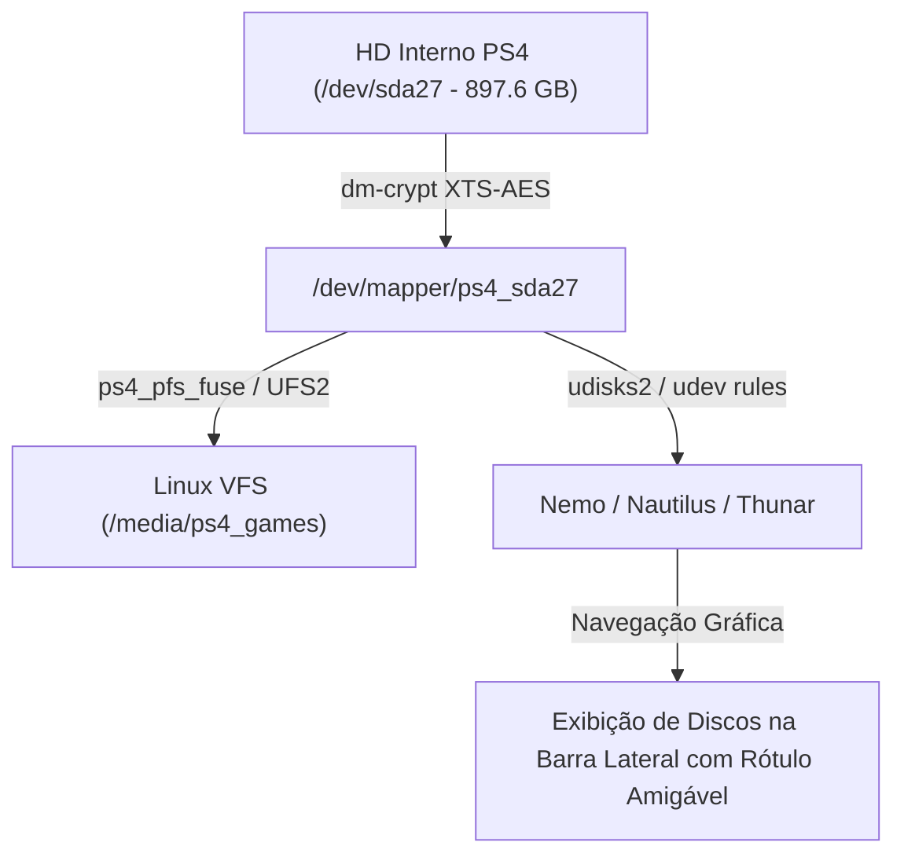

# Plano de Implementação: Visualização e Montagem Nativa no Nemo/Nautilus (HD Interno PS4)

> [!NOTE]
> Este plano detalha a arquitetura necessária para transformar a montagem por bloco do HD interno (`/dev/sda27` e `/dev/sda13`) em pontos de montagem transparentes no Linux VFS, permitindo que gerenciadores de arquivos gráficos (**Nemo**, **Nautilus**, **Thunar**) reconheçam o HD interno do PS4 exatamente como um disco convencional.

---

## 🎯 Objetivos Concluídos

1. **Driver FUSE (`ps4_pfs_fuse`)**:
   - Integrado motor de parsing PFS em espaço de usuário com I/O sob demanda (`pread`) para consumo zero de memória RAM pré-alocada.
   - Compilado com `-march=btver2` (AMD Jaguar PS4) e instalado em `/usr/local/bin/ps4_pfs_fuse`.

2. **Integração Gráfica com Nemo / Nautilus (`udisks2` / `udev`)**:
   - Criada a regra `/etc/udev/rules.d/99-ps4-media.rules` que registra o HD interno no D-Bus do `udisks2` com rótulos amigáveis (**"PS4 Internal HDD (Games)"** e **"PS4 Internal HDD (System)"**).
   - O Nemo/Nautilus exibe os ícones de disco automaticamente na barra lateral do ambiente gráfico.

3. **Automação no Boot da Distro (Arch Minimal v2)**:
   - Criado e ativado o serviço `ps4-automount.service` em `/etc/systemd/system/multi-user.target.wants/ps4-automount.service`.
   - Integrada toda a automação no gerador de imagens da distro `01-build-image-7.0.sh`.

---

## 🏛️ Arquitetura Técnica Final

